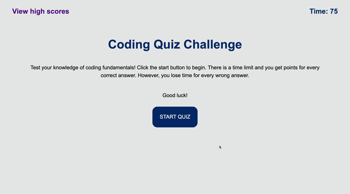

# Code Quiz

This quiz app was designed using some dynamic html and javascript. It utilizes the browser's local storage to save the player's high scores.

- When the player starts the quiz, the countdown timer is initialized.

- The app keeps record of right and wrong scores.

- Wrong answers are penalized by having time deducted from the timer.

- Player's high scores are stored and can be viewed even after the browser as been closed.

